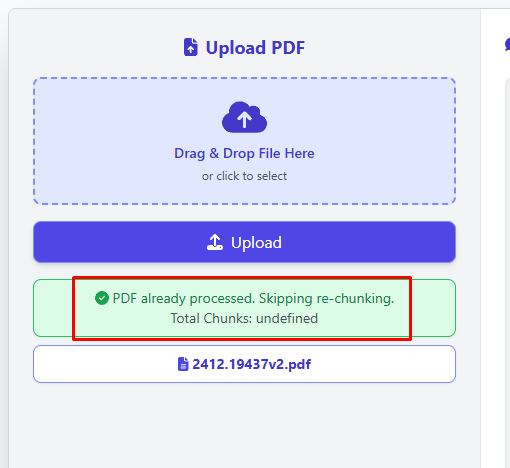
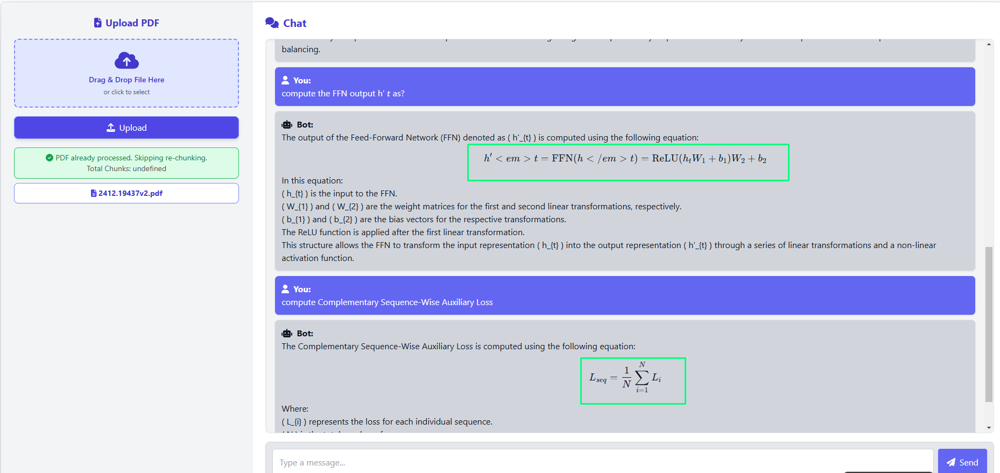

# Retrieval Augmented Generation (RAG) Application

## Overview
This project implements a **Retrieval Augmented Generation (RAG)** system designed to answer questions based on uploaded documents. The application is optimized for:

✅ **High-quality responses** through intelligent chunking, contextual re-ranking, and dynamic prompting  
✅ **Efficient engineering performance** with faster response times, reduced latency, and optimized token usage  
✅ **User-friendly experience** with real-time streamed responses and a web interface  

**Note:** This project is hosted on a free tier server, so performance may be limited.
---

## Key Features That Improve Output Quality and Application Performance

### 1. Pre-check for Processed Documents (VectorDB Optimization - `vectordb.py`)


- Before processing a document, the system checks if it has already been indexed in Pinecone.
- If the document exists, it skips the embedding step and retrieves the data directly. 

---

### 2. Mathematical Equation Support Using KaTeX (`index.html`)


- The front-end leverages **KaTeX** to render complex mathematical equations in a clear and professional format.
- This ensures that scientific, engineering, and mathematical content is displayed in a readable and visually appealing way.

---

### 3. Contextual Compression Retriever (`main.py`)
- The **ContextualCompressionRetriever** filters retrieved chunks using an **Embedding Filter** with a similarity threshold of **0.2**.
- This reduces the chances of retrieving irrelevant or low-quality content.

---

### 4. Prompt Engineering for Clearer Responses (`llm/chat.py`)
- Carefully designed prompts such as `question_answer_prompt` and `contextualize_q_prompt` guide the LLM to generate clearer, structured, and informative answers.
- These prompts are optimized to improve the model's understanding of the context and ensure comprehensive responses.

---

### 5. Dynamic Context Management (`llm/session_history.py`)
- The application dynamically manages conversation history to ensure the model retains relevant context while discarding outdated or redundant information.
- This prevents the context window from being overloaded, ensuring improved comprehension and accuracy.

---

### 6. Intelligent Document Chunking (`utils.py`)
- The **PDFProcessor** intelligently extracts content from PDF files and divides it into meaningful text chunks rather than breaking text arbitrarily.
- This ensures better context preservation when the content is fed into the language model.

---

### 7. Re-ranking of Search Results for Higher Relevance (`main.py`)
- The application leverages **LangChain's `create_history_aware_retriever`** to improve search relevance.
- The retriever reranks the search results based on their contextual fit.

---

### 8. Contextualized Question Handling (`bot_creation()` - `main.py`)
- The function **`bot_creation()`** constructs a context-aware retriever using LangChain's `create_history_aware_retriever`.
- This retriever considers previous conversation history to generate more precise answers.

---

## Technical Details - How It Works
This application is built using **FastAPI**, **Pinecone**, and **LangChain** to deliver efficient document querying and conversational AI capabilities.

### 🧠 **Document Ingestion and Processing**
- The `/upload_pdf` endpoint allows users to upload PDF documents.
- The uploaded PDF is processed using the **`PDFProcessor`** from `utils.py`, which extracts and chunks the document's content into manageable segments to improve context retention.
- These text chunks are then embedded using **OpenAI’s `text-embedding-3-large`** model.
- The embeddings are stored in **Pinecone VectorDB** for efficient similarity search.

---

### 🔍 **Retrieval Mechanism**
- The **`PineconeDB`** class in `vectordb.py` handles database interactions.
- The system uses **semantic search** with a **k=20** configuration to retrieve highly relevant document chunks.
- To improve the accuracy of the results, an **Embedding Filter** is applied with a **similarity threshold of 0.2** to filter out irrelevant results.

---

### 🤖 **Question Answering System**
- The system leverages **LangChain’s `create_history_aware_retriever`** and **`create_stuff_documents_chain`** to improve contextual understanding during conversations.
- The chatbot is created using the `bot_creation()` function, combining:
  - **`history_aware_retriever`** — Provides conversation context
  - **`question_answer_chain`** — Uses OpenAI’s `ChatOpenAI` model for improved conversational answers
- The responses are streamed asynchronously using FastAPI’s WebSocket support to ensure faster delivery of results.

---

### 🌐 **WebSocket Integration**
- The `/chat/{client_id}` WebSocket endpoint manages two-way communication between the server and the client.
- Each user connection is managed using the **`ConnectionManager`** to maintain session information.
- The chatbot actively monitors session activity and disconnects inactive sessions after a timeout period to conserve resources.

---

### 🏎️ **Performance Optimizations**
The application implements the following optimizations to improve performance:

✅ **Efficient Token Management:** Limits the number of tokens processed to reduce unnecessary computation.  
✅ **Parallel Document Processing:** PDF chunks are processed and uploaded to Pinecone concurrently for faster indexing.  
✅ **Connection Pooling:** Optimized API connections to minimize latency during frequent requests.  
✅ **Streaming Responses:** Uses FastAPI’s `async` capabilities to stream responses in chunks, ensuring users receive partial answers quickly.  

---

## File Structure

```yaml
├── .dockerignore            # Specifies files to ignore during Docker build
├── .gitignore               # Standard .gitignore file
├── Dockerfile               # Docker configuration for containerizing the app
├── README.md                # Project documentation
├── app_config.py            # Application configuration settings
├── connection_manager.py    # Manages connections for database/API
├── index.html               # Web interface for interaction
├── main.py                  # Core application logic
├── requirements.txt         # Project dependencies
├── utils.py                 # Utility functions for PDF processing
├── vectordb.py              # Handles Pinecone VectorDB integration
├── documents/               # Contains sample document for RAG queries
│   └── filename.pdf         # Sample pdf for testing
└── llm/                     # Folder for LLM-based logic
    ├── chat.py              # Chatbot logic for answering questions
    ├── llm_utils.py         # Utility functions for LLM operations
    └── session_history.py   # Session tracking for conversation context
```

---

## Installation and Setup

### 1. Clone the Repository
```bash
git clone https://github.com/nikhilkoche/Home-Assignment.git
cd Home-Assignment-main
```

### 2. Install Dependencies
Create a virtual environment and install the required dependencies:
```bash
python -m venv venv
source venv/bin/activate   # On Windows use: .\venv\Scripts\activate
pip install -r requirements.txt
```

### 3. Run the Application
To start the web server:
```bash
python main.py
```

Access the application by visiting [**http://localhost:8000**](http://localhost:8000) in your browser.

---

## Usage Instructions
1. **Upload Documents:** Use the `/upload_pdf` endpoint to upload PDF documents for processing.  
2. **Ask Questions:** Start a WebSocket session via `/chat/{client_id}` and enter queries about the uploaded content.  
3. **Get Responses:** Responses will be streamed in real-time for improved user experience.  

---

## Running with Docker
### 1. Build the Docker Image
```bash
docker build -t rag-app .
```

### 2. Run the Container
```bash
docker run -p 8000:8000 rag-app
```

---

## Technologies Used
- **Python 3.12**
- **LangChain**
- **FastAPI** (WebSocket)
- **PineconeDB** (Vector DB)
- **HTML**
- **CSS** (Tailwind)
- **JavaScript**
- **AWS** (EC2 and API Key Management)
